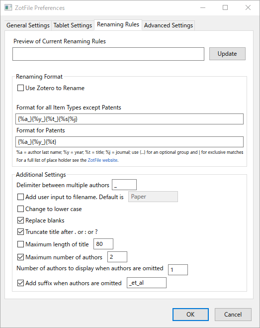

# Zotero 設定

[【令和最新版】文献管理ソフト Zoteroのすゝめ｜SD｜note](https://note.com/sdeso/n/n013952313c1b)を参考に設定を行った．

編集 > 設定 > 詳細 > ファイルとフォルダ
基本ディレクトリはGoogle Drive下に作ったPDF用フォルダを指定した．

マイ・ライブラリに保存していたPDFファイルをドラッグアンドドロップした．

## ZotFile設定
[文献情報とPDFファイルをうまく管理する(zoteroとzotfile) · 大舘暁研究室](https://ohdachi.github.io/ohdachi_lab/researches/2018/02/02/zotero_zotfile.html)を参考に設定を行った．

ツール > ZotFile Preferencesで，Source Folder for Attaching New Filesをダウンロードフォルダに設定．

Renaming Rules
